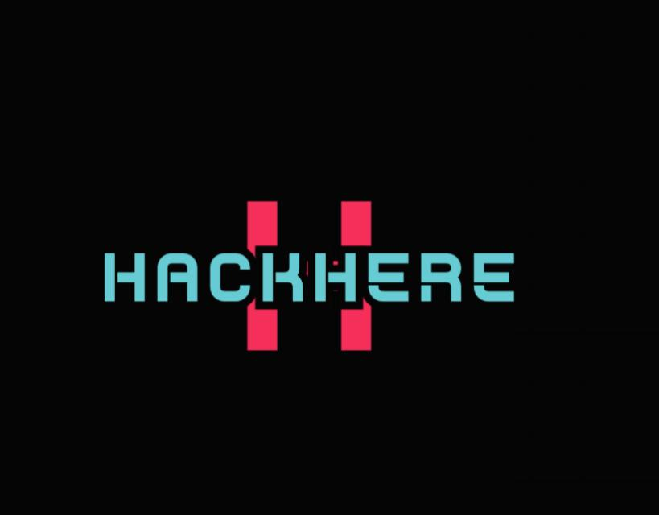

<div align="center">
  
  <h1>AIventra Hackathon 2026</h1>
  <p><strong>CODE. BUILD. GET HIRED.</strong></p>
  <p>A cinematic, futuristic, and highly interactive hackathon website built with React and Framer Motion.</p>

  [](https://reactjs.org/)
  [](https://vitejs.dev/)
  [](https://www.framer.com/motion/)
</div>

<br />

## 🚀 Overview

The **AIventra Hackathon Website** serves as the digital front door for the ultimate tech showdown organized by HackHere. It is designed to provide a completely immersive, high-depth 3D interactive experience. Visitors are greeted by a zero-gravity space aesthetic, complete with a reactive starfield, interactive 3D-tilt cards, and a cinematic journey through the event's missions.

### ✨ Key Features
- **Cinematic Entrance**: Splash screen and hero animations that set a futuristic tone.
- **Interactive UI**: Micro-animations, glassmorphism UI components, and a custom interactive 3D Earth cursor.
- **Planetary Event Details**: Information is presented as a solar system with a central "prize pool" planet and orbiting parameter cards.
- **Engaging Flow**: Custom zigzag scrolling path featuring an animated rocket navigating the event sections.
- **Dynamic Portfolios**: The team section highlights key organizers with full-portrait cards, spinning hover rings, and gradient transitions.

---

## 🛠️ Tech Stack
- **Framework**: React 18
- **Build Tool**: Vite
- **Animations**: Framer Motion
- **Styling**: Vanilla CSS with advanced custom properties (CSS variables), glassmorphism techniques, and CSS grids.

---

## 📂 Project Structure

```text
src/
├── components/          # Reusable UI sections
│   ├── HeroSection      # 3D rocket and space entrance
│   ├── EventDetails     # Planetary orbit layout
│   ├── TeamSection      # Interactive team cards
│   ├── JuriesSection    # Grid layout for upcoming juries
│   ├── SponsorsSection  # Venue, Travel, and Merchandise partners
│   └── ...              # Other core sections
├── App.jsx              # Main layout and scroll logic
├── index.css            # Global styles, variables, and animations
└── main.jsx             # React entry point
```

---

## 💻 Running Locally

To get a local copy up and running, follow these simple steps.

### Prerequisites
Make sure you have [Node.js](https://nodejs.org/) installed on your machine.

### Installation

1. **Clone the repository**
   ```bash
   git clone https://github.com/your-username/aiventra-hackathon.git
   ```

2. **Navigate to the directory**
   ```bash
   cd aiventra-hackathon
   ```

3. **Install the dependencies**
   ```bash
   npm install
   ```

4. **Start the development server**
   ```bash
   npm run dev
   ```
   Open `http://localhost:3000` (or the port provided by Vite) to view it in your browser.

---

## 🤝 Contributing
Contributions are what make the open-source community such an amazing place to learn, inspire, and create. Any contributions you make are **greatly appreciated**.

1. Fork the Project
2. Create your Feature Branch (`git checkout -b feature/AmazingFeature`)
3. Commit your Changes (`git commit -m 'Add some AmazingFeature'`)
4. Push to the Branch (`git push origin feature/AmazingFeature`)
5. Open a Pull Request

---

## 📄 License
Distributed under the MIT License. See `LICENSE` for more information.

---

<div align="center">
  <p>Built with ❤️ by the <a href="https://www.instagram.com/hackhere_connect/">HackHere</a> Team</p>
</div>
